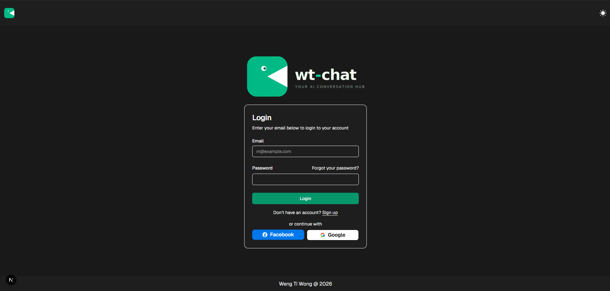
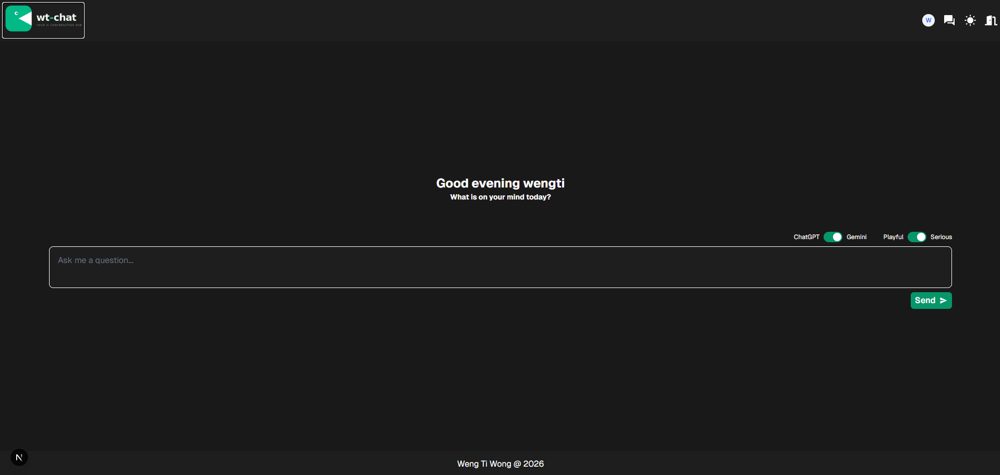
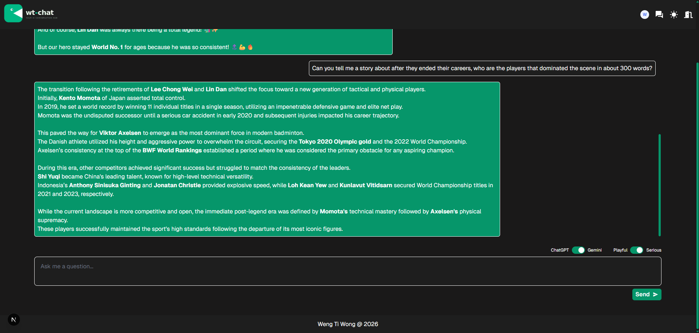

# wt-chat
A simple chat interface for user to interact with 2 different LLM endpoints. This app has the following features

* Authentication and Authorization
* Dark / Light mode
* Chat with Gemini (`gemini-3-flash-preview`) or GPT (`gpt-5.4-nano`)
* Get a response in playful or serious manner.
* Generation of title for each conversation.
* Receiving response in chunks via Streaming.

This application also serves as a simple project for the learning of:

* **FastAPI** with the learning outcome:
    * https://github.com/wengti/fast-api-tutorial
    * https://github.com/wengti/fast-api-ai-endpoint-tutorial

* **pytest** with the learning outcome:
    * https://github.com/wengti/pytest-tutorial

* **docker**
    * https://github.com/wengti/docker-tutorial


## Get Started
* Demo Video: https://youtu.be/mA2SR8Omy-s
* Deployed Site: https://wt-chat.vercel.app

* Remarks:
    -  First request to the FastAPI endpoint may be slow as it is deployed on render (free tier), which will take a minute or so to be activated.
    - Although the AI’s response is being streamed on the backend, render has a buffer that stores all the responses before returning it. 





## Technical Takeaways

### FastAPI
1. Adding CORS middleware in FastAPI
Read more: https://fastapi.tiangolo.com/tutorial/cors/#use-corsmiddleware
```python
app = FastAPI()

app.add_middleware(
    CORSMiddleware,
    allow_origins=[front_end_url],
    allow_methods=["*"],
    allow_headers=["*"],
)
```

2. Stream LLM's token-by-token via `StreamingResponse` class

* `StreamingResponse`
    - Read More: https://fastapi.tiangolo.com/advanced/custom-response/#streamingresponse
    - Takes an async generator or a normal generator/iterator **(a function with yield)** and streams the response body.

```python
from fastapi.responses import StreamingResponse
@app.post("/chat")
def sendMessageToGemini(request: AiRequest, response_model=StreamingResponse):
    return StreamingResponse(
        model.chat(
            history=request.history,
            user_prompt=request.user_prompt,
        ),
        media_type="text/plain",
    )

```

```python
# model.chat() should yield 
response = chat.send_message_stream(message=user_prompt)
for chunk in response:
    text = chunk.text
    if text is not None:
        yield text
```

* Decoding the streamed response on frontend
    - Read More: https://developer.mozilla.org/en-US/docs/Web/API/Streams_API/Using_readable_streams

```js
const reader = res.body.getReader()
const decoder = new TextDecoder()
let response_message = ''
while (true) {
    const { done, value } = await reader.read()
    if (done) break /* Final value is undefined therefore must be checked first before proceeding*/

    const response_chunk = decoder.decode(value, { stream: true })
    response_message += response_chunk

    /* Update the internal state for display */
    if (setChatRecord && convId) {
        setChatRecord((prevChatRecord) => {
            const newChatRecord = structuredClone(prevChatRecord)
            newChatRecord[newChatRecord.length - 1].message = response_message
            return newChatRecord
        })
    }

    /* Delay to slowly streamout the response */
    if (!isNewConversation) {
        await new Promise((resolve) => {
            setTimeout(() => {
                resolve("")
            }, 30)
        })
    }
}
```

3. FastAPI with PyTest using `TestClient`
READ MORE: https://fastapi.tiangolo.com/reference/testclient/

```python
from main import app
client = TestClient(app)

def test_root_get():
    response = client.get("/")
    assert response.status_code == 200
```

### PyTest
1. How to test CORS in pytest and FastAPI
* CORS is enforced the browser.
* The server will only add CORS into the headers.
* Therefore to verify whether CORS is properly working, we can:
    * Method 1: check whether CORS are added into the responses' headers.
    * Method 2: check whether preflight options request is successful.
        * A CORS preflight request is a CORS request that checks to see if the CORS protocol is understood and a server is aware using specific methods and headers.
        * READ MORE about preflight options: https://developer.mozilla.org/en-US/docs/Glossary/Preflight_request

```python
# Method 1: check whether CORS are added into the responses' headers.
def test_cors_returns_headers_from_various_origin(is_allowed: bool, origin: str):
    response = client.get(
        "/",
        headers={
            "Origin": origin,
        },
    )
    if is_allowed:
        assert "access-control-allow-origin" in response.headers
    else:
        assert "access-control-allow-origin" not in response.headers
```

```python
# Method 2: check whether preflight options request is successful.
def test_cors_preflight_from_various_origin(is_allowed: bool, origin: str):
    response = client.options(
        "/",
        headers={
            "Origin": origin,
            "Access-Control-Request-Method": "GET",
        },
    )
    if is_allowed:
        assert response.status_code == 200
        
    else:
        assert response.status_code == 400        
```

2. Response code of wrong type given.
* Initially set up the following to prevent the endpoint is hit with a invalid model name:
```python
if model == None:
    raise HTTPException(status_code=500, detail="Fail to create an AI client.")
```

* Through testing, I have only then found out that because I have typed the request model name to be `Literal['gemini', 'gpt']`, any other provided name will automatically be resolved to `422 Unprocessable Content`.
* This code indicates that the server understood the content type of the request content, and the syntax of the request content was correct, but it was unable to process the contained instructions.
* READ MORE about 422: https://developer.mozilla.org/en-US/docs/Web/HTTP/Reference/Status/422

3. Testing Design Takeaways - Should the testing hit the LLM endpoint?
* The implemented test cases here hit the LLM's endpoint directly to get a response and examnined whether the returned response is as expected.
* However, on large scale testing, frequent testing and hitting the LLM's endpoint is not advisable for 2 reasons:
    - Incurred uncessary cost for hitting the API
    - LLM's endpoint's returned response may change in the future.
* Therefore, the optimal practice should be:
    * Make uses of the following tools from `pytest-mock` (READ MORE: https://github.com/wengti/pytest-tutorial):
        * `mocker.patch()` - replace functions in the **normal code flow** that involves hitting the API and return a fake response
        * `mocker.Mock()` - replace functions **not in the normal code flow** that involves hitting the API and return a fake response
        * `.assert_called_once()` - ensures that the code flow still hits a certain function 
        * `.assert_called_once_with()` - ensures that the code flow still hits a certain function with certain parameters
        * `.assert_not_called()` - ensures that the code flow does not hit a certain function
    * The idea of using these tools is not to ensure the logic of the code that we've written is working as intended instead of being overly concerned what the external API will return.
    * However, htting LLM's endpoint is still necessary to ensure that the integration is successful. **The key is that it should be minimized**. 


### OpenAI's GPT models implementation
1. Pass in past messages with the correct types:
* Pay attention to the use of `ResponseInputItemParam` and `EasyInputMessageParam` to fulfill the type requirements for `input` parameter in `.responses.create()`

```python
from openai.types.responses import EasyInputMessageParam, ResponseInputItemParam

def chat(self, history: list[HistoryEntry], user_prompt: str) -> Generator[str]:

    messages: list[ResponseInputItemParam] = [
        EasyInputMessageParam(
            role="user" if entry["role"] == "user" else "assistant",
            content=entry["message"],
        )
        for entry in history
    ]

    messages.append(EasyInputMessageParam(role="user", content=user_prompt))

    response = self.client.responses.create(
        model=self.model_name,
        instructions=self.system_prompt,
        input=messages,
        stream=True,
    )

    for event in response:
        if event.type == "response.output_text.delta":
            yield event.delta
```

    

